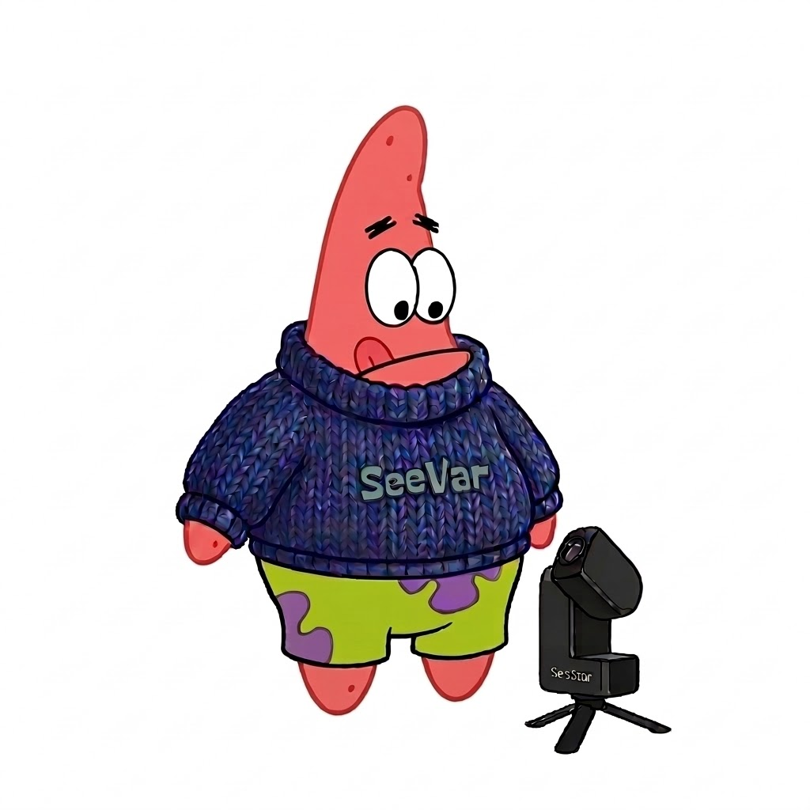

# 🔭 SeeVar



Transform a consumer smart telescope into a fully autonomous scientific instrument for variable star photometry.

SeeVar is an autonomous observing and data pipeline for the ZWO Seestar S30-Pro.
Its purpose is simple:

- plan scientifically useful observations
- capture trustworthy raw science frames
- reduce them into defensible photometry
- prepare results for AAVSO submission

This project no longer treats the telescope as a consumer imaging toy.
It treats it as a small robotic observatory.

---

## Mission

SeeVar is built for long-term monitoring of variable stars, with current emphasis on:

- Long Period Variables: Mira and Semi-Regular stars
- Cataclysmic Variables during outburst and follow-up

The guiding goal is not pretty pictures.
It is repeatable, honest measurement.

Observation cadence follows AAVSO-style scientific needs rather than casual imaging habits.

---

## Current Status

SeeVar is in active beta and scientific hardening.

As of April 2026, the project has already confirmed:

- direct hardware control via ZWO's built-in ASCOM Alpaca driver on port `32323`
- autonomous nightly planning
- sovereign flight execution with a canonical `A1-A12` sequence
- Bayer-aware raw FITS capture
- simulator support for end-to-end workflow testing
- split-fleet planning and scoped execution for multiple Seestars
- dashboard ABORT / RESET controls
- a postflight architecture now frozen around a canonical `P1-P8` chain

The current chapter is **v1.9.x: scientific hardening and fleet execution**.

That means the next priority is not discovering more hardware control.
It is making the science chain more defensible and operationally safer:

- solved WCS and honest photometric rejection in postflight
- dark-calibrated working frames, with bias / flat plumbing added
- sigma-clipped comparison-star ensembles
- deterministic AAVSO report staging
- multi-scope execution without shared-file collisions

---

## Why This Exists

Small telescopes can do real science if they are operated consistently.

The Seestar S30-Pro is affordable and capable hardware, but its consumer workflow is not designed for disciplined photometry. SeeVar exists to bridge that gap by adding:

- deterministic mission planning
- scientific cadence awareness
- raw FITS custody
- postflight quality control
- observatory-style logging and state tracking

The result is a telescope that can work unattended while still producing scientifically meaningful output.

---

## System Overview

SeeVar is organized as a sovereign observing pipeline:

1. **Preflight**
   Builds the nightly plan, applies cadence and horizon logic, checks weather and hardware, and decides whether the mission is allowed to start.

2. **Flight**
   Executes one canonical target sequence per object using the `A1-A12` flight chain:
   target lock, safety gate, session init, slew, verify, settle, exposure planning, acquire, quality gate, and commit.

3. **Postflight**
   Processes captured frames using the `P1-P8` science chain:
   ingest, calibration matching, calibration application, astrometric solve, source measurement, ensemble calibration, quality verdict, and commit/report.

4. **Oversight**
   Dashboard, logs, notifier, and ledger state remain available throughout the entire mission.

---

## Hardware Interface

SeeVar communicates with the Seestar through the official Alpaca REST interface exposed by the telescope firmware.

Confirmed device access includes:

- Telescope
- Telephoto camera
- Wide-angle camera
- Filter wheel
- Focuser
- Dew-heater switch

This means:

- no phone app required
- no session master lock
- no middleware required for the core control path

The telescope is treated as a directly controlled instrument.

---

## Scientific Direction

### Raw-first custody

SeeVar captures and preserves raw science FITS.
Flight ends when a trustworthy raw frame has been captured and committed.

### Bayer-aware photometry

SeeVar does not rely on naive debayering for production photometry.
Its scientific direction is Bayer-aware source measurement directly on the sensor mosaic.

Current reporting direction:

- science channel: `G`
- reporting code: `TG`

### Astrometric and detector truth matter

A magnitude is only trustworthy if the pipeline can justify:

- detector truth
- astrometric truth
- photometric truth

That is why postflight is now being hardened aggressively.

---

## Storage Philosophy

Scientific data should not depend on SD-card luck.

Recommended deployment:

- Raspberry Pi running Debian Bookworm
- external USB storage
- mirrored RAID1 data storage for observation products
- live volatile state in RAM where appropriate

The operating system lives on the SD card.
Observation data, caches, and science products should live on more reliable storage.

---

## Installation

Install on a fresh Raspberry Pi OS Lite 64-bit system:

```bash
bash <(curl -fsSL https://raw.githubusercontent.com/edjuh/seevar/main/bootstrap.sh)
```

The bootstrap process is intended to:

- install dependencies
- create the Python environment
- collect site and telescope configuration
- prepare system services
- bring the observatory into a runnable state

For full instructions, see `INSTALL.md`.

For upgrading an existing checkout, see `UPGRADE.MD` or run:

```bash
cd ~/seevar
curl -fsSL https://raw.githubusercontent.com/edjuh/seevar/main/upgrade.sh | bash
```

## Practical Notes

### Starter Catalog

SeeVar ships with a starter `catalogs/campaign_targets.json` so a new install has a usable target set immediately.

Runtime-generated catalog products remain local:

- `catalogs/federation_catalog.json`
- `catalogs/reference_stars/`

### Fleet Mode

`fleet_mode` lives in `[planner]`:

- `single` = one shared queue
- `split` = divide work across active scopes
- `auto` = choose based on live scope availability

Split planning writes both combined and per-scope artifacts under `data/fleet_plans/` and `data/fleet_payloads/`.

### Dashboard Controls

The dashboard now exposes operator controls for:

- `ABORT`
- `RESET`

`ABORTED` is treated as a hard stop. `RESET` returns the orchestrator to `IDLE` so the system can be re-armed cleanly.

### Horizon Scanning

The active scanner is `core/preflight/horizon_scanner_v2.py`.
It produces:

- `data/horizon_mask.json`
- `data/horizon_mask.csv`
- `data/horizon_mask.png`
- `data/horizon_frames/` debug artifacts

It can export two different Stellarium artifacts:

- a polygonal horizon package for mathematically correct obstruction geometry
- a spherical panorama package for visual context

The polygonal package contains:

- `horizon.txt`
- `landscape.ini`
- `location.json`
- `readme.txt`

The spherical panorama package contains:

- `panorama.png`
- `horizon.txt`
- `landscape.ini`
- `location.json`
- `readme.txt`

For the visual package, prefer real RGB photos or videos over scanner luma frames.
See `core/preflight/stellarium_panorama_from_media.py` for building a panorama zip
from normal JPEG/MP4 inputs, or `core/preflight/stellarium_panorama_capture.py`
for a guided capture flow that can switch the Seestar into `scenery` mode and
pull newly saved JPEGs from a mounted Seestar media share (default mount:
`~/seevar/s30_storage`) or directly from an `smb://...` Seestar share URI.
The capture flow now watches for a newly written scenery file by default and
supports a fixed azimuth correction for mounts whose reported headings are offset.

Example:

```bash
cd ~/seevar
/home/ed/seevar/.venv/bin/python core/preflight/horizon_scanner_v2.py \
  --ip 192.168.8.11 \
  --output /home/ed/seevar/data/horizon_mask.json \
  --stellarium-zip /home/ed/seevar/data/stellarium/SeeVar_JO22hj.zip \
  --stellarium-name "SeeVar JO22hj Polygon" \
  --stellarium-panorama-zip /home/ed/seevar/data/stellarium/SeeVar_JO22hj_panorama.zip \
  --stellarium-panorama-name "SeeVar JO22hj Panorama"
```

## Documentation

Project doctrine and architecture live in `dev/logic/`.

Good starting points:

- `CORE.MD`
- `ARCHITECTURE_OVERVIEW.MD`
- `STATE_MACHINE.MD`
- `FLIGHT.MD`
- `POSTFLIGHT.MD`
- `PHOTOMETRICS.MD`
- `ROADMAP.md`

## Astropy

SeeVar contains some custom implementations that grew out of the project's early phases, before the full breadth of Astropy was properly appreciated.

Current direction:

- use Astropy more where it improves correctness, maintainability, and scientific trust
- keep custom code where the problem is genuinely SeeVar-specific, especially:
- Bayer-aware photometry
- Seestar-specific hardware behavior
- mission-state orchestration
- custody and observatory workflow

This is an area of active review, not a philosophical rejection of Astropy.

## Beta Expectations

SeeVar is not pretending to be finished.

What is already real:

- Alpaca control
- nightly planning
- simulator-supported mission flow
- raw FITS capture
- split fleet planning and scoped execution
- postflight scientific doctrine

What is still under active hardening:

- solved WCS as a hard postflight dependency
- final flat / bias capture workflow and full application policy
- ensemble sigma clipping
- final reporting path

That is the honest state of the project.

## Contributing

Testers and technically minded contributors are welcome.

Please open an issue first if the change affects:

- mission sequencing
- protocol assumptions
- scientific validity
- ledger semantics
- observatory doctrine

For contribution standards, see `CONTRIBUTING.md`.

## Philosophy

Good hardware deserves serious use.

A small telescope, careful automation, and scientific discipline can produce real observations night after night. SeeVar exists to make that possible without pretending that autonomy is the same thing as trust.

The project's rule is simple:

If a frame is not proven, it is not accepted.
