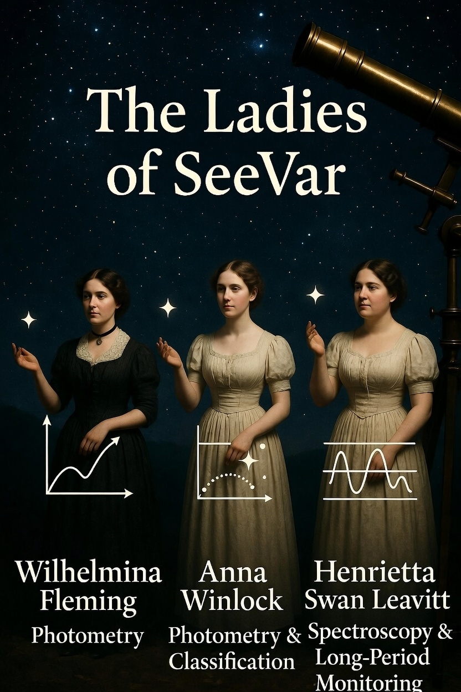

# SeeVar Presentation & Architecture Metaphors

This document pairs the SeeVar presentation slides with the architectural narrative. It serves both as a speaker's guide for astronomy club presentations and as a high-level conceptual overview for developers joining the SeeVar Federation.

*(Note: Ensure the slide images are placed in the same directory or adjust the image paths accordingly).*

---

## Slide 1: The Hook

**Narrative:**
* **The Pitch:** SeeVar isn't just about taking pretty pictures of the night sky; it is a relentless, autonomous science machine.
* **The Context:** It took 6 weeks and 17 architectural revisions to achieve full "Sovereign" autonomy. One telescope. One endless loop. One mission.

---

## Slide 2: The Hardware & Inspiration

**Narrative:**
* **The Homage:** The telescope nodes and logic branches are named after the pioneers of variable star classification—the Harvard Computers (Wilhelmina Fleming, Anna Winlock, Henrietta Swan Leavitt).
* **The Setup:** "Wilhelmina" (the S30-Pro) handles the primary photometry duties for this specific pipeline.

---

## Slide 3: The High-Level Pipeline

**Narrative:**
* **The Workflow:** This is the logic engine at a glance. SeeVar gathers the AAVSO targets, groups them, queues them up, examines them, measures the photometry, predicts the next observation window, and repeats.

---

## Slide 4: Beating the Hardware Limits

**Narrative:**
* **The Problem:** Standard alt-azimuth mounts and basic slew commands are highly inefficient for rapid-fire targeting.
* **The Solution:** The Orchestrator groups the night's plan strictly by Western → Southern → Eastern sectors. This minimises dome and mount travel time, maximising actual photon-gathering time.

---

## Slide 5: The Core Metaphor

*(Visual variations: [0.jpg](0.jpg), [1.jpg](1.jpg))*

**Narrative:**
* **The Concept:** Think of `ledger_manager.py` and `tonights_plan.json` as a physical conveyor belt.
* **The Mechanics:** The targets are suspended in a queue, waiting for their precise turn to drop into the telescope's examination pipe. It is a strictly controlled, deterministic flow.

---

## Slide 6: The Execution

**Narrative:**
* **The Micro-Level:** What happens during the few minutes the telescope spends on a single target?
* **The Action:** The mount stops (Ring stops), the star drops into the pipe, the exposure planner acquires the raw FITS (Raw photo taken), the accountant measures the differential photometry, and the star returns to the ledger.

---

## Slide 7: The Scientific Cadence

**Narrative:**
* **The Intelligence:** This separates SeeVar from a simple GoTo script. It enforces the "1/20th rule".
* **The Logic:** The system reads the star's period (e.g., V404 Cygni's 6.5 days) to dynamically calculate exactly when it needs to be placed back on the conveyor belt to ensure science-grade sampling.

---

## Slide 8: The Wrap-Up

**Narrative:**
* **The Conclusion:** While the world sleeps, SeeVar is out there quietly and relentlessly building a pristine ledger of scientific data, night after night.

---

## Pipeline Animation — Kaspar

A 1080p60 animation of the full SeeVar pipeline.

> **[▶ Watch SeeVar_The_Movie on YouTube](https://youtu.be/qG439gE7UBo)**

Rendered with Manim on Pi 5. Pipeline: checkerboard → ring → conveyor belt → results.
*"Helder, Kaspar?"*

---

## Session Notes — v1.8 Snotolf (March 2026)

### Weather logic redesign (`weather.py` v1.8.0)

The tri-source consensus was redesigned around a fundamental scientific
principle: **cloud cover is not a reason to stop imaging.**

**Hard abort conditions (telescope in):**
- Measured precipitation — KNMI `ww` >= 50 (rain, snow, hail, showers)
- Measured fog/mist — KNMI `ww` 10-12
- Thunderstorm — KNMI `ww` 17, 29, 91-99
- Poor visibility — KNMI `vv` < configured limit
- Forecast fog — Clear Outside `fog` > 0
- Forecast precipitation — open-meteo `precip` > limit
- Wind — open-meteo `wind_speed_10m` > limit

**Warning only — telescope keeps imaging:**
- Cloud cover at any level (low / mid / high) — all sources
- KNMI oktas — display only
- Humidity — dew heater cue only

The previous `window_max()` approach evaluated the worst hour across the
entire dark window and aborted on any cloud. The new per-hour evaluation
finds the best contiguous imaging block within the dark period and reports
it as `imaging_window_start` / `imaging_window_end` in `weather_state.json`.

The orchestrator reads `imaging_go: true/false` — not the status string —
to make the go/no-go decision.

### `pilot.py` analysis (v1.6.2 -> v1.7 pending first light)

The peer review confirmed that port 4700 is a stateful event stream, not
a classic request/response API. The current `recv_response()` method reads
the first `\r\n`-terminated line and may catch an unsolicited telemetry
push instead of the command ACK. The `time.sleep(SETTLE_SECONDS)` at T2
and fire-and-forget `start_auto_focuse` at T3 are acknowledged gaps,
documented as FIRST LIGHT REQUIRED in `logic/FLIGHT.MD`.

The fix — `wait_for_event()` on `ControlSocket` with timeout fallback to
the existing sleep — will be implemented once `ssh_monitor.py` confirms
the real event field names from Wilhelmina's logs at first light (April 2026).

### Testers & outreach
- Metius (Amstelveen) — presentation given March 2026, well received
- Arenda — tester #1, SD card ready
- Boyce-Astro Observatory — introduction made
